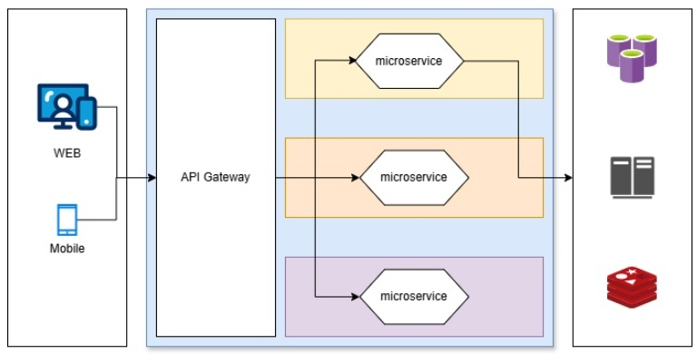

# Solution Design

# [Flujo]

Versión 1.0 Dic 05, 2024

## Control de cambios 

| Fecha  | Versión  | Descripción del cambio  | Realizó  | Aprobó  |
| -- | -- | -- | -- | -- |
|   |   |   |   |   |
|   |   |   |   |   |
|   |   |   |   |   |

Contenido

1. Feature: Login.....................................................4

2. ADRS que contemplan la desición​............................................4

3. Alcance​................................................................................4

4. Diagramas de la Arquitectura General​5

Descripción​............................................................................5

Diagrama de componentes​.............................................................5

Flujo de la solución​....................................................................5

6. Riesgos y Consideraciones​..................................................6

7. Referencias​............................................................................6

8. Errores de negocio​.........................................................7

9. Dependencias​.........................................................................7

10. Integración​7

11. Orígenes de datos​7

12. Referencias de arquitectura​8

## 1. Feature: Login

| Arquitectos/TLs responsables  | Tarea principal del feature  | Historia de usuario  | Aprobadores de la solución  | Fecha de aprobación  | Tarea referente a la aprobación de la solución  |
| -- | -- | -- | -- | -- | -- |
|   |   |   |   |   |   |
|   |   |   |   |   |   |

2. ADRS que contemplan la desición

| ID ADR  | Descripción  |
| -- | -- |
| ONE-001-Login-Elección RabitMQ[Link del ADR]  | Breve descripción del ADR  |
|   |   |

## 3. Alcance

Objetivo de la solución 

Implementar un login único del usuario simplificando el acceso del mismo de las diferentes aplicaciones. 

## 4. Diagramas de la Arquitectura General

## Descripción 

Explica cómo interactúan los microservicios en este flujo.

Diagrama de componentes

Diagrama de contexto 

Flujo de la solución

Diagrama de Secuencia:

[Descripción de los pasos del diagrama]

6. Riesgos y Consideraciones

Riesgos genéricos previstos:

●​ Latencia en servicios externos debido a cargas altas.

●​ Fallos en la base de datos durante el flujo.

●​ Errores en comunicación entre microservicios. 

7. Referencias

●​ Swagger del flujo:

○​ Gestión de Cuentas.[Link swagger]

○​ Gestión de Transacciones. [Link swagger]

### ●​ Documentación de Microservicios relacionados: 

○​ Gestión de Cuentas. [Link de documentos del microservicios]​

○​ Gestión de Transacciones. [Links de documento del microservicio] 

### 9. Dependencias

10. Integración

#### Errores de negocio

Descripción de los diferentes errores de negocio dentro de la solución 

| Codigo de error  | Descripción del error  |
| -- | -- |
| BN001  | Contraseña incorrecta  |
| BN002  | Producto no disponible  |

### 11. Orígenes de datos

Descripción de los diferentes orígenes de datos que impactan la solución

| Nombre del catalogo  | Tipo de origen de datos de datos  | Nombre de la base/colección/path  | Descripción  | Externo o interno  |
| -- | -- | -- | -- | -- |
| Catálogo de productos  | MongoDB  | products_debit  | Utilizado para sincronizar los productos de debito  | Interno  |
| Catálogo de mensajes  | Oracle  | mensajes_app  | Utilizado para almacenar los códigos de error de la aplicación  | Interno  |

12. Referencias de arquitectura

